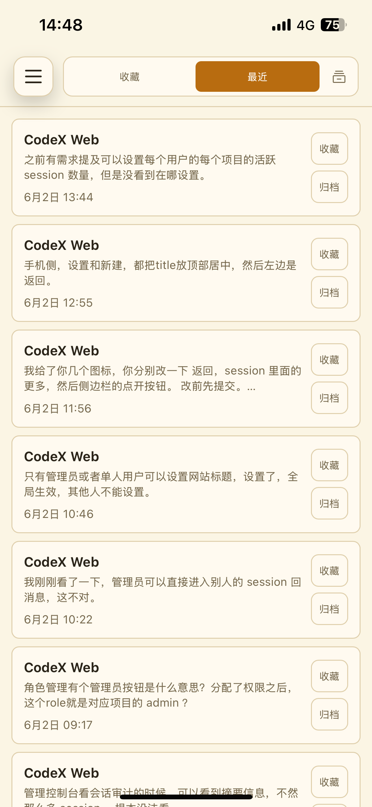
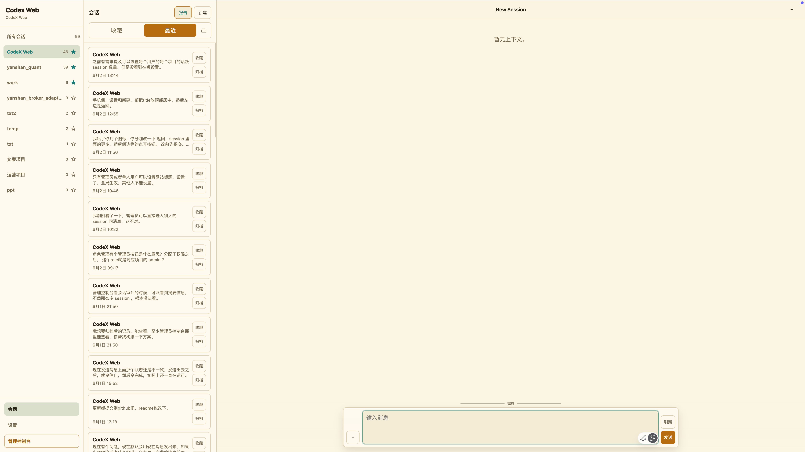
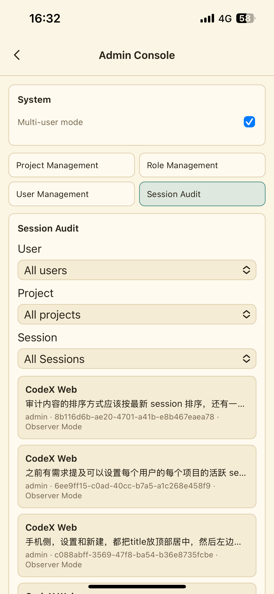
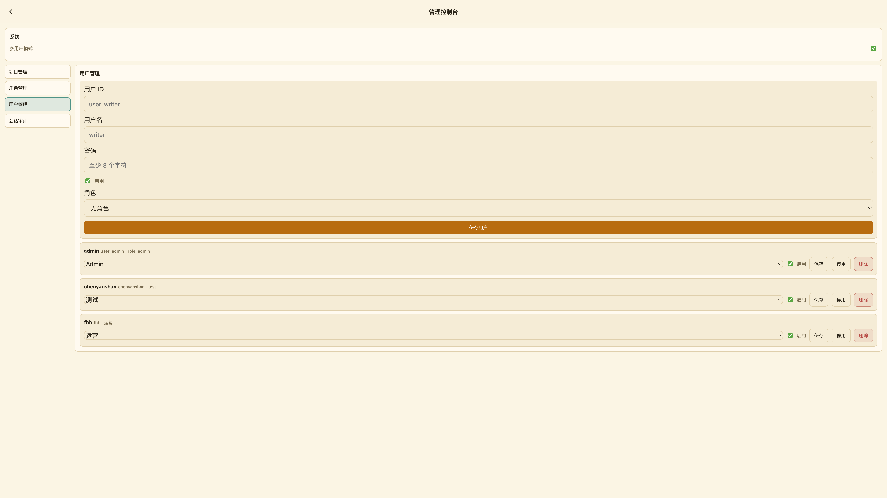

# Codex Phone Hub

English | [中文](README.zh-CN.md)

Codex Phone Hub is a self-hosted web console for controlling a local logged-in
Codex runtime from a phone, tablet, or desktop browser.

The browser is only a remote UI. The Mac or Linux host keeps Codex credentials,
starts the Codex runtime, reads and writes local project files, executes shell
commands, and stores app state. Tunnel and reverse-proxy setup are intentionally
outside this repository.

> Ask Codex to install it:
> `Help me install https://github.com/guhaigg/codex-phone-hub/blob/main/README.md`

## Core Highlights

### 1. Remote Codex control from anywhere

Codex Web keeps Codex credentials, shell execution, and local file access on the
host machine, while your phone or browser becomes a remote console. When
combined with your own tunnel or reverse proxy, it becomes a practical way to
reconnect and operate Codex remotely at any time without moving execution into
the browser.

| Mobile remote console | Desktop workspace |
| --- | --- |
|  |  |

- Remote UI for phone, tablet, and desktop browsers.
- Project-first workspace with live sessions, chat, and turn status.
- Fits LAN-only installs and remote-access setups built with your own network
  edge.

### 2. Multi-user foundation for internal agents

Codex Web also supports a multi-user facade that can be used as the base for
internal enterprise agents built on top of Codex. Teams can expose controlled
workspaces to employees, keep administration on the host, and manage access with
RBAC instead of sharing one Codex login.

| Mobile admin audit | Desktop user management |
| --- | --- |
|  |  |

- Multi-user mode, project management, role management, and user management.
- RBAC for project access, admin operations, observer mode, and share links.
- Session audit views for reviewing activity across users, projects, and
  sessions.

## What It Does

- Password-protected single-host Codex web console.
- PWA-friendly mobile UI with persistent per-device browser sessions.
- Project-first workspace: desktop uses a project rail, session list, and chat
  pane; mobile uses a project drawer.
- Live Codex turn stream with assistant deltas, final answers, command batches,
  file-change batches, approval requests, and runtime errors.
- Multi-user/RBAC facade for project access, admin management, observer mode,
  and read-only share links.
- Share links open a dedicated read-only conversation page with the full session
  context and no workspace navigation.
- File and image attachments for turns. The backend stores files locally and
  passes safe local paths to Codex.
- Authenticated report index and report viewer, plus the bundled
  `codex-mobile-report` skill.
- A bundled `codex-web-user-context` skill for discovering the current Codex
  Web user/project context from a server-projected runtime file.
- macOS launchd and Linux systemd service helpers.
- English and Simplified Chinese UI language setting, plus a backend-managed
  site title for admins/single-user installs.

## Repository Layout

```text
packages/codex-native-api   reusable Codex app-server integration
packages/codex-web          HTTP API, auth, runtime bridge, and web UI
scripts/install             AI-guided installer scripts
scripts/service             launchd service helpers
skills/codex-mobile-report  companion report skill
skills/codex-web-user-context current Codex Web user/project context skill
docs/superpowers/specs      design docs
docs/superpowers/plans      implementation plans
docs/rendering              local markdown/report rendering fixtures
```

This repository was split out from an earlier Codex Web prototype and is now
published as `Codex Phone Hub`.

## Maintenance Docs

- [API and runtime map](docs/API_MAP.md)
- [Deployment guide](docs/DEPLOYMENT.md)
- [Mobile E2E checklist](docs/MOBILE_E2E.md)
- [Project handover guide](docs/HANDOVER.zh-CN.md)

## Requirements

- Node.js `>=24`
- npm
- local Codex CLI installed
- local Codex login at `~/.codex/auth.json` or `CODEX_HOME/auth.json`

## Quick Start

Install dependencies:

```bash
npm install
```

Set the web password:

```bash
npm run codex-web -- auth set-password
```

Start the web service:

```bash
npm run serve
```

By default the service listens on `0.0.0.0:43210`, so phones on the same LAN can
reach it. Open the printed local or LAN URL and log in with the configured
password.

Run checks:

```bash
npm run typecheck
npm test
```

## AI Install

Use the root [install.md](install.md) when asking Codex or another coding agent
to install this project from a GitHub blob link or local checkout.

Example Codex request:

```text
Help me install https://github.com/guhaigg/codex-phone-hub/blob/main/README.md
```

Expected agent behavior:

- If the user provides a GitHub `README.md` or `install.md` blob link, derive
  the repo root and follow `install.md`.
- If the user says "help me install this project" from inside a local checkout,
  find the repo root and follow `install.md`.
- On macOS, ask for the web password and whether launchd autostart should be
  installed.
- On Windows, stop and report that this repository does not provide a Windows
  installer.

The automated macOS flow uses:

```text
install.md
scripts/install/install-codex-web-macos.sh
```

The installer handles dependency install, password setup, service start,
optional launchd autostart, and installation of the bundled report skill.

## Configuration

Runtime state lives outside the repo.

Default paths:

```text
~/.config/codex-web/service.env
~/.codex-web/auth.json
~/.codex-web/logs/
~/.codex-web/reports/
~/.codex-web/report-index.json
~/.codex-web/uploads/
```

`~/.codex-web/auth.json` stores only salted password hashes and hashed session
tokens. The browser stores only an opaque session token. Do not store
`CODEX_WEB_PASSWORD` in `service.env`.

For non-interactive first setup, a one-time environment variable is supported:

```bash
CODEX_WEB_PASSWORD='choose-a-strong-password' npm run serve
```

The generated service env defaults to:

```env
CODEX_WEB_HOST=0.0.0.0
CODEX_WEB_PORT=43210
CODEX_WEB_DEFAULT_CWD=/Users/you/path/to/codex-web
CODEX_REAL_BIN=codex
CODEX_WEB_DEBUG=0
```

Edit `~/.config/codex-web/service.env` to change host, port, default working
directory, or Codex binary. To restrict access to the local machine only:

```env
CODEX_WEB_HOST=127.0.0.1
```

## Attachments

The composer can upload files and images for the next Codex turn. All upload
routes require authentication.

Writable project directory:

```text
<project-cwd>/uploads/<user-id>/
```

Fallback storage:

```text
~/.codex-web/uploads/projects/<project-key>/<user-id>/
```

The backend returns the actual `localPath` and validates attachment paths
against allowed upload roots before starting a turn. Images are passed to Codex
as local images; other files are listed in the turn prompt with local paths.

Upload limits:

```text
32 MiB request body
25 MiB per file
```

## Reports Skill

The companion skill lives at:

```text
skills/codex-mobile-report
```

Install it into local Codex skills:

```bash
mkdir -p ~/.codex/skills
mkdir -p ~/.codex/skills/codex-mobile-report
cp -R skills/codex-mobile-report/. ~/.codex/skills/codex-mobile-report/
```

For active development, symlink it instead:

```bash
mkdir -p ~/.codex/skills
ln -s "$(pwd)/skills/codex-mobile-report" ~/.codex/skills/codex-mobile-report
```

The skill writes phone-readable Markdown or self-contained HTML reports under
`~/.codex-web/reports/`. Codex Web exposes those reports through authenticated
APIs and renders report links in the app.

## User Context Skill

The Codex Web user-context skill lives at:

```text
skills/codex-web-user-context
```

Install it into local Codex skills:

```bash
mkdir -p ~/.codex/skills
mkdir -p ~/.codex/skills/codex-web-user-context
cp -R skills/codex-web-user-context/. ~/.codex/skills/codex-web-user-context/
```

For active development, symlink it instead:

```bash
mkdir -p ~/.codex/skills
ln -s "$(pwd)/skills/codex-web-user-context" ~/.codex/skills/codex-web-user-context
```

This skill is bundled in the repository and should be installed into the local
system Codex skills directory at `~/.codex/skills/` like the other shipped
skills. During Codex Web turns, the server projects a small runtime context
file and injects its absolute path into the turn instructions so the skill can
discover the current authenticated Codex Web user, email, and project context.

## Runtime Status

The status above the composer is the runtime state, not a request spinner. It is
reconciled from live turn events and refreshed session history.

- Active turns show `Running`.
- Successful terminal turns show `Done`.
- Interrupted, cancelled, or aborted turns show `Stopped`.
- Provider/runtime failures such as `401`, `403`, `429`, or unexpected provider
  statuses are rendered as red system messages in the conversation timeline.

If the Codex Web service restarts while a turn is in progress, Codex may mark
that turn as `interrupted` without an error payload. The UI shows `Stopped`
instead of a red error because the turn ended due to service lifecycle
interruption.

## Service Install

### macOS launchd

Install the user LaunchAgent:

```bash
scripts/service/install-codex-web-launchd-user.sh
```

Service helpers:

```bash
scripts/service/status-codex-web-launchd-user.sh
scripts/service/restart-codex-web-launchd-user.sh
scripts/service/restart-codex-web-launchd-user-detached.sh
scripts/service/logs-codex-web-launchd-user.sh
```

Use the detached restart helper when Codex Web needs to restart itself from a
running Codex-controlled session.

### Linux systemd

Create the service environment:

```bash
mkdir -p ~/.config/codex-web ~/.codex-web/logs
cat > ~/.config/codex-web/service.env <<EOF
CODEX_WEB_HOST=0.0.0.0
CODEX_WEB_PORT=43210
CODEX_WEB_DEFAULT_CWD=$(pwd)
CODEX_REAL_BIN=codex
CODEX_WEB_DEBUG=0
EOF
chmod 600 ~/.config/codex-web/service.env
```

Create and start a user service:

```bash
mkdir -p ~/.config/systemd/user
cat > ~/.config/systemd/user/codex-web.service <<EOF
[Unit]
Description=Codex Web mobile console
After=network-online.target

[Service]
Type=simple
WorkingDirectory=$(pwd)
EnvironmentFile=%h/.config/codex-web/service.env
ExecStart=/usr/bin/env npm run serve --workspace packages/codex-web
Restart=on-failure
RestartSec=3

[Install]
WantedBy=default.target
EOF

systemctl --user daemon-reload
systemctl --user enable --now codex-web.service
systemctl --user status codex-web.service
```

Read logs:

```bash
journalctl --user -u codex-web.service -f
```

## Install As PWA

After the server is running, open Codex Web from your phone browser and log in
once.

On iPhone or iPad: open in Safari, tap `Share`, then `Add to Home Screen`.

On Android: open in Chrome, open the browser menu, then tap `Install app` or
`Add to Home screen`.

More notes: [docs/pwa-setup.md](docs/pwa-setup.md).

## Design Docs

Current design and implementation notes:

```text
docs/superpowers/specs/2026-05-17-codex-web-design.md
docs/superpowers/specs/2026-05-19-codex-mobile-reports-design.md
docs/superpowers/specs/2026-05-23-codex-web-desktop-workspace-design.md
docs/superpowers/specs/2026-05-27-codex-web-multi-user-rbac-design.md
docs/superpowers/specs/2026-05-28-role-project-new-session-design.md
docs/superpowers/specs/2026-05-29-codex-web-workspace-redesign-design.md
docs/superpowers/specs/2026-05-30-codex-web-attachments-design.md
docs/superpowers/specs/2026-06-01-session-card-first-message-design.md

docs/superpowers/plans/2026-05-17-codex-web-mvp.md
docs/superpowers/plans/2026-05-23-codex-web-desktop-workspace.md
docs/superpowers/plans/2026-05-27-codex-web-multi-user-rbac.md
docs/superpowers/plans/2026-05-28-role-project-new-session.md
docs/superpowers/plans/2026-05-29-codex-web-workspace-redesign.md
docs/superpowers/plans/2026-05-30-codex-web-attachments.md
docs/superpowers/plans/2026-06-01-session-card-first-message.md
docs/superpowers/plans/2026-06-01-timeline-error-ordering.md
```

Visual reference:

```text
docs/assets/codex-web-reference.jpg
```
